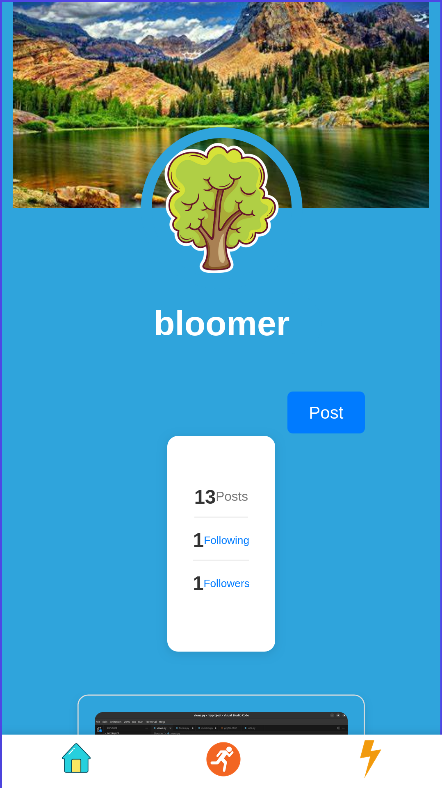
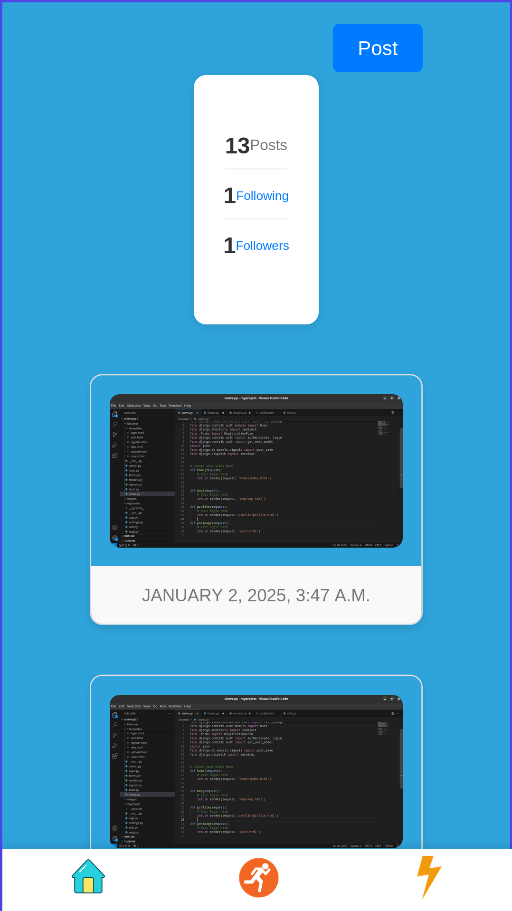
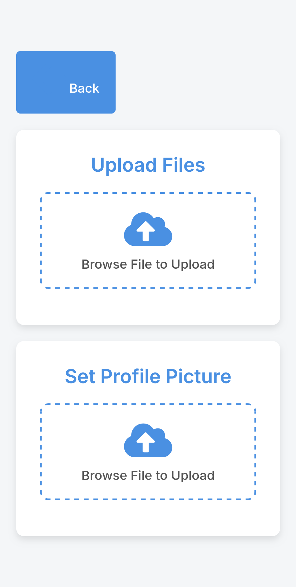
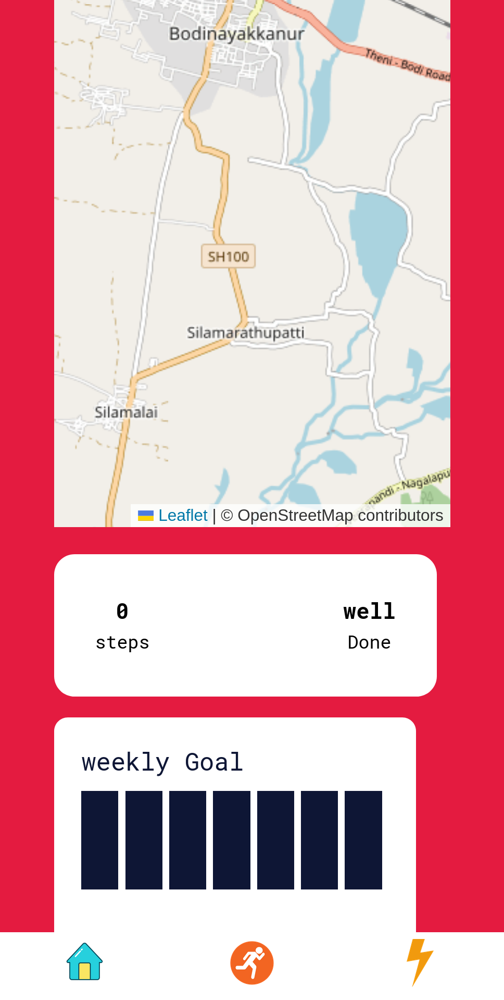

# Social Media App with Fitness Tracker in Django Python

This project is a comprehensive social media platform that integrates fitness tracking features, built using Django and Python.

---

## Image Gallery

  

    
    
Feature 1

  

  

    
    
Feature 2

  

  

    
    
Feature 3

  

  

    
    
Feature 4

  

  

    
    
Feature 5

  

  

    
    
Feature 6

  

